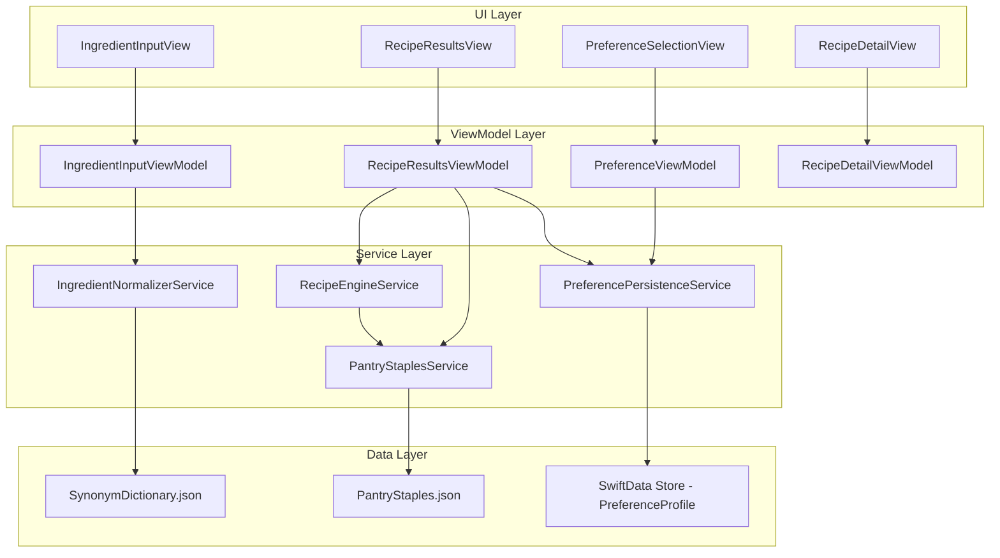
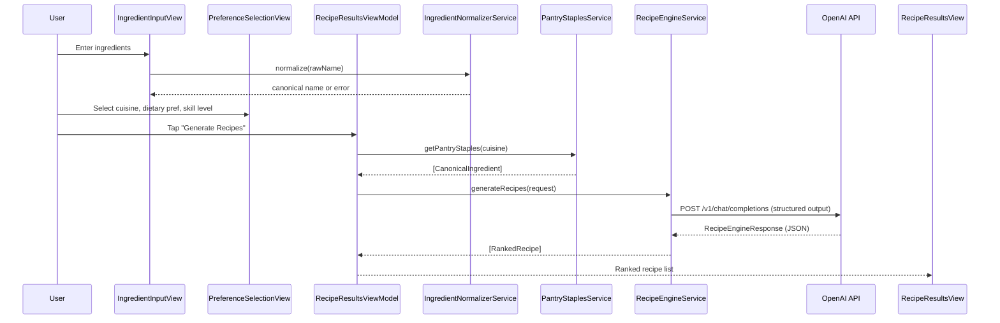

# Design Document: ChefNova iOS App

## Overview

ChefNova is an iOS application built with SwiftUI that helps users discover recipes based on ingredients they already have. The app sends user inputs (ingredient list, cuisine, dietary preference, skill level) to an AI-powered Recipe Engine (OpenAI API with structured outputs) and presents ranked recipe suggestions with gap-filling guidance for partial matches.

### Key Design Decisions

- **SwiftUI + MVVM with `@Observable`** (iOS 17+): Aligns with Apple's modern reactive UI pattern, reduces boilerplate, and keeps views declarative and testable.
- **OpenAI Chat Completions API with JSON Schema (Structured Outputs)**: Guarantees well-formed recipe responses without post-processing heuristics. The Recipe Engine is a thin prompt-construction + response-parsing layer.
- **SwiftData for Preference Persistence**: Type-safe, SwiftUI-native persistence for the Preference Profile. Simpler than CoreData for the small data footprint required.
- **Local Normalizer with synonym dictionary**: Ingredient normalization runs entirely on-device using a bundled JSON synonym map, avoiding a network round-trip for validation and enabling offline feedback.
- **Pantry Staples as static cuisine-keyed data**: Defined in a bundled JSON file, injected into the Recipe Engine prompt rather than stored per-user, keeping the model simple.

### Target Platform

- iOS 17+
- SwiftUI, Swift 6 concurrency (`async`/`await`)
- Xcode 16+

---

## Architecture

The app follows a layered MVVM + Service architecture with a clear dependency direction: Views → ViewModels → Services → Models.



### Data Flow for Recipe Generation



---

## Components and Interfaces

### IngredientNormalizerService

Responsible for mapping raw user input to canonical ingredient names using a bundled synonym dictionary.

```swift
protocol IngredientNormalizerServiceProtocol {
    /// Returns the canonical form of the ingredient name, or nil if unrecognized.
    func normalize(_ rawName: String) -> String?
    
    /// Returns true if the raw name maps to a known canonical ingredient.
    func isRecognized(_ rawName: String) -> Bool
}
```

**Implementation notes:**
- Loads `SynonymDictionary.json` once at app launch (lazy singleton).
- Performs case-insensitive, whitespace-trimmed lookup.
- Returns `nil` for unrecognized inputs (triggers inline validation error in the view).

### PantryStaplesService

Provides the cuisine-specific list of implicitly available ingredients.

```swift
protocol PantryStaplesServiceProtocol {
    /// Returns the pantry staples for the given cuisine.
    func getPantryStaples(for cuisine: Cuisine) -> [String]
    
    /// Returns true if the ingredient is a pantry staple for the given cuisine.
    func isPantryStaple(_ ingredient: String, for cuisine: Cuisine) -> Bool
}
```

**Implementation notes:**
- Loads `PantryStaples.json` once at app launch.
- All comparisons are case-insensitive against canonical ingredient names.

### RecipeEngineService

Constructs prompts, calls the OpenAI API, and parses structured responses.

```swift
protocol RecipeEngineServiceProtocol {
    func generateRecipes(request: RecipeGenerationRequest) async throws -> [RankedRecipe]
}

struct RecipeGenerationRequest {
    let ingredients: [String]          // canonical ingredient names
    let pantryStaples: [String]        // from PantryStaplesService
    let cuisine: Cuisine
    let dietaryPreference: DietaryPreference?
    let skillLevel: SkillLevel
}
```

**Implementation notes:**
- Uses OpenAI Chat Completions API with `response_format: { type: "json_schema", json_schema: RecipeEngineResponseSchema }` to guarantee structured output.
- Constructs a system prompt that instructs the model to act as a recipe generator, respect pantry staples as implicitly available, and return results in the defined JSON schema.
- Applies a 10-second `URLSession` timeout; throws `RecipeEngineError.timeout` on expiry.
- Maps HTTP 5xx responses to `RecipeEngineError.serverError`.
- Maps network unavailability to `RecipeEngineError.networkUnavailable`.

### PreferencePersistenceService

Saves and loads the user's Preference Profile using SwiftData.

```swift
protocol PreferencePersistenceServiceProtocol {
    func savePreferences(_ profile: PreferenceProfile) throws
    func loadLatestPreferences() -> PreferenceProfile?
}
```

### ViewModels

| ViewModel | Responsibilities |
|---|---|
| `IngredientInputViewModel` | Manages ingredient list state; calls normalizer; validates non-empty list |
| `PreferenceViewModel` | Manages cuisine/dietary/skill selections; loads/saves preference profile |
| `RecipeResultsViewModel` | Orchestrates recipe generation; manages loading/error/results state |
| `RecipeDetailViewModel` | Manages serving size adjustment; recalculates ingredient quantities |

---

## Data Models

### Core Domain Models

```swift
// Canonical ingredient name (always normalized)
typealias CanonicalIngredient = String

enum Cuisine: String, Codable, CaseIterable {
    case northIndian = "North Indian"
    // Additional cuisines added here
}

enum DietaryPreference: String, Codable, CaseIterable {
    case vegetarian = "Vegetarian"
    case nonVegetarian = "Non-Vegetarian"
}

enum SkillLevel: String, Codable, CaseIterable {
    case beginner = "Beginner"
    case intermediatePro = "Intermediate/Pro"
    case chefLevel = "Chef Level"
}

struct RecipeIngredient: Codable, Equatable {
    let name: CanonicalIngredient
    let quantity: Double
    let unit: String
}

struct Recipe: Codable, Identifiable, Equatable {
    let id: UUID
    let title: String
    let cuisine: Cuisine
    let dietaryClassification: DietaryPreference
    let skillLevel: SkillLevel
    let prepTimeMinutes: Int
    let cookTimeMinutes: Int
    let servingSize: Int
    let ingredients: [RecipeIngredient]
    let steps: [String]
}

struct RankedRecipe: Identifiable, Equatable {
    let id: UUID
    let recipe: Recipe
    let matchScore: Double          // 0.0 – 1.0
    let isPartialMatch: Bool
    let gapIngredients: [GapIngredient]  // empty for full matches
}

struct GapIngredient: Equatable {
    let name: CanonicalIngredient
    let commonalityRank: Int        // lower = more common
    let purchaseSearchURL: URL
}
```

### Persistence Model (SwiftData)

```swift
@Model
final class PreferenceProfile {
    var cuisine: String
    var dietaryPreference: String?   // nil = no preference
    var skillLevel: String
    var savedAt: Date
    
    init(cuisine: String, dietaryPreference: String?, skillLevel: String) {
        self.cuisine = cuisine
        self.dietaryPreference = dietaryPreference
        self.skillLevel = skillLevel
        self.savedAt = Date()
    }
}
```

### Bundled Data Files

**`SynonymDictionary.json`** — maps variant names to canonical names:
```json
{
  "onions": "Onion",
  "red onion": "Onion",
  "onion": "Onion",
  "tomatoes": "Tomato",
  "tomato": "Tomato"
}
```

**`PantryStaples.json`** — maps cuisine to staple ingredient list:
```json
{
  "North Indian": [
    "Salt", "Black Pepper", "Red Chilli Powder", "Turmeric",
    "Cumin Seeds", "Coriander Powder", "Garam Masala", "Oil"
  ]
}
```

### OpenAI Structured Output Schema

The Recipe Engine sends this JSON schema to the OpenAI API to enforce structured responses:

```json
{
  "name": "recipe_engine_response",
  "strict": true,
  "schema": {
    "type": "object",
    "properties": {
      "recipes": {
        "type": "array",
        "items": {
          "type": "object",
          "properties": {
            "title": { "type": "string" },
            "cuisine": { "type": "string" },
            "dietary_classification": { "type": "string", "enum": ["Vegetarian", "Non-Vegetarian"] },
            "skill_level": { "type": "string", "enum": ["Beginner", "Intermediate/Pro", "Chef Level"] },
            "prep_time_minutes": { "type": "integer" },
            "cook_time_minutes": { "type": "integer" },
            "serving_size": { "type": "integer" },
            "match_score": { "type": "number", "minimum": 0, "maximum": 1 },
            "ingredients": {
              "type": "array",
              "items": {
                "type": "object",
                "properties": {
                  "name": { "type": "string" },
                  "quantity": { "type": "number" },
                  "unit": { "type": "string" },
                  "is_gap": { "type": "boolean" }
                },
                "required": ["name", "quantity", "unit", "is_gap"],
                "additionalProperties": false
              }
            },
            "steps": { "type": "array", "items": { "type": "string" } }
          },
          "required": ["title", "cuisine", "dietary_classification", "skill_level",
                       "prep_time_minutes", "cook_time_minutes", "serving_size",
                       "match_score", "ingredients", "steps"],
          "additionalProperties": false
        }
      }
    },
    "required": ["recipes"],
    "additionalProperties": false
  }
}
```

**Gap ingredient post-processing** (on-device, after API response):
1. Filter `ingredients` where `is_gap == true`.
2. Exclude any ingredient whose canonical name is in the Pantry Staples list for the selected cuisine.
3. Sort remaining gap ingredients by `commonalityRank` (ascending).
4. Truncate to maximum 5 gap ingredients.
5. Construct `purchaseSearchURL` as `https://www.google.com/search?q=buy+{ingredient}`.

### Serving Size Adjustment

`RecipeDetailViewModel` computes adjusted quantities using a pure scaling function:

```swift
func adjustedQuantity(original: Double, originalServings: Int, targetServings: Int) -> Double {
    guard originalServings > 0 else { return original }
    return original * (Double(targetServings) / Double(originalServings))
}
```

---

## Correctness Properties

*A property is a characteristic or behavior that should hold true across all valid executions of a system — essentially, a formal statement about what the system should do. Properties serve as the bridge between human-readable specifications and machine-verifiable correctness guarantees.*

### Property 1: Normalizer Idempotence

*For any* canonical ingredient name in the synonym dictionary, normalizing it a second time SHALL return the same canonical name as the first normalization.

**Validates: Requirements 7.4**

### Property 2: Normalizer Round-Trip Stability

*For any* ingredient name variant present in the synonym mapping, normalizing it and then normalizing the result SHALL return the same canonical name as the first normalization.

**Validates: Requirements 7.5, 1.3**

### Property 3: Unrecognized Ingredient Returns Nil

*For any* string that does not appear in the synonym dictionary (neither as a key nor as a canonical value), the normalizer SHALL return nil (the not-recognized signal), leaving the Ingredient List unchanged.

**Validates: Requirements 1.4, 7.3**

### Property 4: Whitespace-Only Ingredients Are Rejected

*For any* string composed entirely of whitespace characters (spaces, tabs, newlines), submitting it as an ingredient SHALL result in the normalizer treating it as unrecognized and the Ingredient List remaining unchanged.

**Validates: Requirements 9.5, 1.7**

### Property 5: Match Score Ordering

*For any* recipe generation result containing two or more recipes, the recipes SHALL be ordered such that no recipe appears before another recipe with a strictly higher match score (i.e., the list is sorted by match score in descending order).

**Validates: Requirements 4.1**

### Property 6: Pantry Staples Excluded from Gap Ingredients

*For any* partial match recipe result and any selected cuisine, no ingredient that appears in the Pantry Staples list for that cuisine SHALL appear in the Gap Ingredients list displayed for that recipe.

**Validates: Requirements 5.1, 10.4**

### Property 7: Gap Ingredient Processing Invariants

*For any* partial match recipe with any number of raw gap ingredients: (a) the displayed gap ingredients SHALL contain at most 5 entries, (b) the displayed gap ingredients SHALL be ordered by commonality rank in ascending order (most common first), and (c) every displayed gap ingredient SHALL have a non-nil purchase search URL.

**Validates: Requirements 5.2, 5.3, 5.4**

### Property 8: Serving Size Proportional Scaling

*For any* recipe with a positive original serving size and any positive target serving size, every ingredient quantity in the adjusted recipe SHALL equal the original quantity multiplied by the ratio of target serving size to original serving size.

**Validates: Requirements 6.3**

### Property 9: Preference Profile Round-Trip

*For any* valid combination of Cuisine, DietaryPreference (including nil), and SkillLevel, saving that combination as a Preference Profile and then loading the most recent Preference Profile SHALL return values equal to the saved combination.

**Validates: Requirements 2.5, 3.6, 8.1, 8.2, 8.4**

### Property 10: Pantry Staples Included in Recipe Generation Request

*For any* selected cuisine, the RecipeGenerationRequest constructed for that cuisine SHALL include all pantry staples for that cuisine in its `pantryStaples` field.

**Validates: Requirements 10.2**

---

## Error Handling

### Error Types

```swift
enum RecipeEngineError: Error, LocalizedError {
    case timeout
    case networkUnavailable
    case serverError(statusCode: Int, logMessage: String)
    case noResultsFound
    case invalidResponse
}

enum IngredientValidationError: Error {
    case unrecognized(rawName: String)
    case emptyList
    case allWhitespace
}
```

### Error Handling Strategy

| Error Condition | User-Facing Message | Recovery Action |
|---|---|---|
| Unrecognized ingredient | "We didn't recognize '{name}'. Please check the spelling." | Inline field error; user revises |
| Empty ingredient list | "Please add at least one ingredient before generating recipes." | Inline error; no navigation |
| No cuisine selected | "Please select a cuisine to continue." | Inline error; no navigation |
| Recipe Engine timeout (>10s) | "This is taking longer than expected. Please try again." | Retry button |
| Network unavailable | "No internet connection. Please check your network and try again." | Retry button (enabled when connectivity restored) |
| Server error (5xx) | "Something went wrong on our end. Please try again shortly." | Retry button; error logged internally |
| No recipes found | "No recipes found for your inputs. Try adding more ingredients or changing your filters." | Suggestion to modify inputs |

### Error Logging

Server errors (5xx) are logged using `os.Logger` with the HTTP status code and a sanitized request identifier. Technical details are never surfaced to the user. No PII (ingredient names, preferences) is included in log entries.

### Network Monitoring

`RecipeResultsViewModel` uses `Network.framework`'s `NWPathMonitor` to observe connectivity state. The retry button is disabled while the network path is unsatisfied and re-enabled automatically when connectivity is restored.

---

## Testing Strategy

### Dual Testing Approach

ChefNova uses both unit/example-based tests and property-based tests:

- **Unit tests**: Verify specific examples, edge cases, error conditions, and integration points between components.
- **Property-based tests**: Verify universal correctness properties across randomized inputs using [SwiftCheck](https://github.com/typelift/SwiftCheck), the QuickCheck-inspired PBT library for Swift.

### Property-Based Tests

Each property test uses [SwiftCheck](https://github.com/typelift/SwiftCheck) and runs a minimum of **100 iterations**. Each test is tagged with a comment referencing the design property it validates.

| Test | Property | Tag |
|---|---|---|
| `testNormalizerIdempotence` | Property 1 | `Feature: chef-nova-app, Property 1: Normalizer idempotence` |
| `testNormalizerRoundTrip` | Property 2 | `Feature: chef-nova-app, Property 2: Normalizer round-trip stability` |
| `testUnrecognizedIngredientReturnsNil` | Property 3 | `Feature: chef-nova-app, Property 3: Unrecognized ingredient returns nil` |
| `testWhitespaceIngredientRejection` | Property 4 | `Feature: chef-nova-app, Property 4: Whitespace-only ingredients rejected` |
| `testMatchScoreOrdering` | Property 5 | `Feature: chef-nova-app, Property 5: Match score ordering` |
| `testPantryStaplesExcludedFromGaps` | Property 6 | `Feature: chef-nova-app, Property 6: Pantry staples excluded from gap ingredients` |
| `testGapIngredientProcessingInvariants` | Property 7 | `Feature: chef-nova-app, Property 7: Gap ingredient processing invariants` |
| `testServingSizeScaling` | Property 8 | `Feature: chef-nova-app, Property 8: Serving size proportional scaling` |
| `testPreferenceProfileRoundTrip` | Property 9 | `Feature: chef-nova-app, Property 9: Preference profile round-trip` |
| `testPantryStaplesIncludedInRequest` | Property 10 | `Feature: chef-nova-app, Property 10: Pantry staples included in recipe generation request` |

### Unit Tests

Unit tests cover:
- `IngredientNormalizerService`: specific synonym mappings, case-insensitive lookup, unrecognized input returns `nil`
- `PantryStaplesService`: correct staples returned per cuisine, `isPantryStaple` boundary cases
- `RecipeEngineService`: mock URLSession responses for timeout, 5xx, network error, empty results, valid results
- `RecipeDetailViewModel`: serving size adjustment with integer and fractional quantities, edge case of `targetServings == originalServings`
- `PreferencePersistenceService`: save then load round-trip, overwrite with new values
- `RecipeResultsViewModel`: gap ingredient post-processing pipeline (exclusion, sorting, truncation)

### Integration Tests

- End-to-end recipe generation with a real OpenAI API key (run in CI with a dedicated test key, gated behind an environment variable flag)
- Preference persistence across simulated app restarts using an in-memory SwiftData container

### UI Tests (XCUITest)

- Ingredient input flow: add, remove, attempt empty submission
- Preference selection: cuisine required validation, dietary preference optional
- Recipe results list: verify recipe cards render with title, match score, time, skill level
- Recipe detail: serving size stepper adjusts displayed quantities
- Error states: network error banner, retry button interaction
